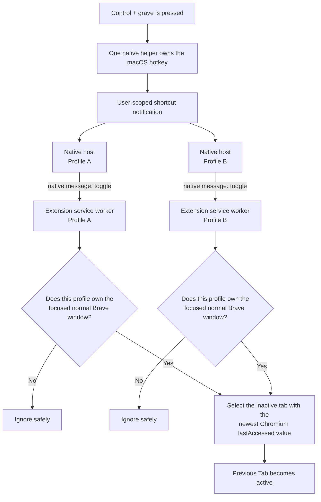

<div align="center">
  

# Recent Tab Toggle

**Edge-style instant tab switching for Brave on macOS**

Press <kbd>Control</kbd> + <kbd>`</kbd> to move between the two tabs you used most recently:

**A → B → A → B**

</div>

> Recent Tab Toggle is an independent open-source project. It is not affiliated with or endorsed by Brave Software.

## What does it do?

Think of it like the **“last channel” button on a TV remote**. Instead of cycling through every open tab, one key press returns to the tab you were using immediately before this one. Press it again to come back.

```text
Start                  First key press          Second key press
┌─────────┬─────────┐  ┌─────────┬─────────┐   ┌─────────┬─────────┐
│ Tab A   │ Tab B ● │  │ Tab A ● │ Tab B   │   │ Tab A   │ Tab B ● │
└─────────┴─────────┘  └─────────┴─────────┘   └─────────┴─────────┘
            active        active                              active
```

If you use A, then B, then C, the first toggle opens B and the next toggle returns to C. “Recent” means **recently active**, not recently opened.

## Highlights

- Uses the exact <kbd>Control</kbd> + <kbd>`</kbd> shortcut.
- Switches immediately between the **Active Tab** and **Previous Tab**.
- Keeps separate tab history for every Brave window.
- Works safely with multiple Brave profiles.
- Supports pinned, grouped, collapsed, and discarded tabs.
- Requires no Accessibility or Input Monitoring permission.
- Has no site access, telemetry, or network requests.
- Includes a diagnostics popup, fallback shortcut, installer, uninstaller, tests, CI, and release tooling.
- Supports both Apple silicon and Intel Macs.

## Why are there two components?

A browser extension is the right place to decide which Brave tab to activate. However, Chromium does not allow a backtick in extension keyboard shortcuts, even when the shortcut is assigned at `brave://extensions/shortcuts`.

Recent Tab Toggle solves this by giving each component one small job:

| Component | Job |
|---|---|
| **Manifest V3 extension** | Finds and activates the Previous Tab in the focused Brave window. |
| **Swift native helper** | Registers the exact macOS shortcut and sends a simple `toggle` signal to the extension. |

The helper is like a doorbell: it knows the button was pressed, but it does not know which websites or tabs are open. The extension remains responsible for all browser behavior.

## Architecture



### What happens after a key press?

1. **macOS receives the shortcut.** One elected helper process registers the physical Control–grave hotkey while Brave Stable is frontmost.
2. **The event reaches every connected profile.** Brave starts one native-messaging host for each extension profile. A user-scoped notification fans the event out to those hosts.
3. **Each host sends one small message.** The native protocol message is simply `{"type":"toggle"}`.
4. **Only the focused profile continues.** Every extension instance checks Brave itself. Profiles that do not own the focused normal window ignore the event.
5. **The extension asks Chromium for the tabs.** It chooses the inactive existing tab with the newest `lastAccessed` value.
6. **Chromium activates that tab.** Chromium updates activation metadata, so the next press naturally returns to the tab you just left.

Toggle requests are processed one at a time, preventing held keys or rapid presses from racing each other.

### Why the multi-profile design is safe

The native helper can tell that Brave is frontmost, but macOS cannot reliably tell it which Brave profile owns a window. The extension can answer that through the browser API. Therefore, all profiles hear the signal, but **only the profile with the focused window is allowed to act**.

### Why this does not need Accessibility permission

The helper registers one declared system hotkey using macOS’s Carbon hotkey API. It does not monitor or intercept keyboard input. The registration exists only while Brave Stable is the frontmost application, so the project does not consume the shortcut in other apps.

## Requirements

- macOS 13 or newer
- Brave Stable based on Chromium 121 or newer
- Apple silicon or Intel Mac
- Apple Command Line Tools with Swift 6

Install the command-line tools if needed:

```sh
xcode-select --install
```

No paid Apple Developer account and no administrator access are required for source installation.

## Install from source

From the repository root, install the native helper:

```sh
./scripts/install.sh
```

Then load the extension:

1. Open `brave://extensions`.
2. Enable **Developer mode**.
3. Select **Load unpacked**.
4. Choose this repository’s `extension/` directory.
5. If it was already loaded, select **Reload** on the extension card.
6. Open at least two tabs and press <kbd>Control</kbd> + <kbd>`</kbd>.

The extension ID is intentionally pinned to:

```text
edcgmlcjhdpdanpfhgcnbkeppbaijbmd
```

A stable ID allows Brave to authorize only this extension to connect to the helper.

## Verify the installation

Run the installation doctor:

```sh
./scripts/doctor.sh
```

It checks the extension identity and permissions, Brave compatibility, helper architecture, both native manifests, and a live native-messaging exchange.

You can also select the extension icon in Brave. The diagnostics popup reports:

- whether the native helper is connected;
- whether the exact shortcut is active or conflicts with another app;
- whether this profile owns the focused Brave window; and
- whether a test toggle succeeds.

## What the installer changes

The installer builds the Swift helper locally and atomically installs user-scoped files. It does not use `sudo`.

```text
~/Library/Application Support/RecentTabToggle/
└── bin/recent-tab-toggle-host

~/Library/Application Support/BraveSoftware/Brave-Browser/
└── NativeMessagingHosts/org.recenttabtoggle.host.json

~/Library/Application Support/Google/Chrome/
└── NativeMessagingHosts/org.recenttabtoggle.host.json
```

The second manifest is a compatibility registration required by affected Brave versions on macOS. Both manifests authorize only the pinned Recent Tab Toggle extension ID; they do not grant access to other extensions.

## Behavior and edge cases

| Situation | Result |
|---|---|
| Fewer than two tabs exist | Nothing happens. |
| The Previous Tab was closed | The next most recently active existing tab is selected. |
| Multiple Brave windows are open | Each window has independent activation history. |
| Multiple Brave profiles are open | Only the profile owning the focused window acts. |
| Brave is not frontmost | The exact shortcut is not registered and is not consumed. |
| DevTools or another non-normal window has focus | The request is ignored. |
| Tabs are pinned, grouped, collapsed, or discarded | They remain eligible normally. |
| The key is pressed rapidly | Requests are serialized and processed in order. |
| The helper disconnects | The extension retries with bounded backoff; opening diagnostics triggers an immediate retry. |
| Another app owns the shortcut | Diagnostics reports a conflict; the project does not override it. |

On non-US keyboard layouts, the native shortcut follows the **physical ANSI grave-key position**.

## Fallback shortcut without the helper

The extension’s tab-selection logic works without the Swift helper:

1. Open `brave://extensions/shortcuts`.
2. Find **Toggle the two most recently active tabs**.
3. Assign any shortcut Chromium accepts.

The exact Control–grave combination still requires the helper because Chromium rejects that key in extension commands.

## Troubleshooting

| Problem | What to do |
|---|---|
| **Helper not found** | Run `./scripts/install.sh`, reload the extension at `brave://extensions`, then run `./scripts/doctor.sh`. Restart Brave if needed. |
| **Shortcut conflict** | Quit or reconfigure the app using Control–grave, then focus Brave again. |
| **Connected but no toggle** | Confirm a normal Brave window is focused and that it contains at least two tabs. Use **Test toggle** in the popup. |
| **Wrong key on a non-US layout** | Use the physical key in the ANSI grave-key position. |
| **Still disconnected after restoring files** | Open the extension popup to force an immediate connection attempt. |

For deeper checks, see the extension popup’s **Install & troubleshooting** link and [`docs/manual-test-plan.md`](docs/manual-test-plan.md).

## Privacy and security

Recent Tab Toggle follows a deliberately narrow security model:

- The extension requests only `nativeMessaging`.
- It requests no website host permissions.
- It cannot read page content, tab titles, URLs, or browser history.
- Neither component makes network requests or sends telemetry.
- The helper does not record keystrokes or request Accessibility/Input Monitoring access.
- The native manifest permits only the pinned extension origin.
- The extension activates only an existing tab in the focused normal Brave window.
- Installation is limited to the current macOS user.

The helper receives only shortcut and connection-status events. Native protocol output is kept separate from diagnostic output so logs cannot corrupt browser messages.

See [`SECURITY.md`](SECURITY.md) for the complete security policy and reporting process.

## What has been built

The project includes more than the core toggle:

- A dependency-free Manifest V3 extension.
- A dependency-free Swift native-messaging host.
- Exact, permission-free macOS hotkey registration.
- Process leadership and event fan-out for multiple profiles.
- Focused-window safety gates.
- Native connection handshakes, bounded retries, and recovery diagnostics.
- Atomic installation and reversible uninstallation.
- Brave and Chrome-compatibility native host registration.
- Deterministic extension archives and SHA-256 checksums.
- Tests for extension behavior, native protocol, both CPU architectures, multi-profile routing, installation, diagnostics, and packaging.
- Linting for JavaScript metadata, shell, Python, Swift, and GitHub Actions.
- Commit-pinned CI and release workflows.
- Architecture documentation, security policy, manual test plan, release process, and architectural decision records.

## Repository layout

```text
extension/
├── src/          Tab selection, service worker, and native connection
├── popup/        Status, diagnostics, test action, and local help
└── test/         Dependency-free JavaScript behavior tests

native/
├── Sources/      Swift hotkey, messaging, leadership, and event fan-out
└── Tests/        Native protocol and coordination tests

scripts/          Build, install, uninstall, doctor, validation, and packaging
docs/adr/         Architectural decision records
docs/             Architecture, manual test plan, and release procedure
CONTEXT.md        Canonical product language and behavior
SECURITY.md       Security posture and vulnerability reporting
```

## Development

Developer requirements are macOS 13+, Node.js 20+, Swift 6+, ShellCheck, Ruff, and actionlint.

```sh
brew install shellcheck ruff actionlint

make lint       # Check formatting, workflows, shell, Python, and manifest rules
make test       # Run extension, native, architecture, installer, and package tests
make build      # Build the release-mode native helper
make install    # Build and install the helper for the current user
make doctor     # Verify the complete local installation
make package    # Create a deterministic extension zip and SHA-256 checksum
make uninstall  # Remove the installed helper and manifests
```

Before submitting a change:

```sh
make lint && make test
```

Behavior changes should be test-first and should use the domain language in [`CONTEXT.md`](CONTEXT.md). See [`CONTRIBUTING.md`](CONTRIBUTING.md) for the full contribution rules.

## Design documentation

- [`CONTEXT.md`](CONTEXT.md) — precise meaning of Active Tab, Previous Tab, Browser Window, Browser Profile, and Tab Toggle.
- [`docs/architecture.md`](docs/architecture.md) — detailed system design, native protocol, security boundaries, and failure behavior.
- [`docs/adr/`](docs/adr/) — why the exact shortcut uses a native helper, why events fan out across profiles, and why Carbon hotkey registration was chosen.
- [`docs/manual-test-plan.md`](docs/manual-test-plan.md) — GUI and lifecycle checks required before release.
- [`docs/releasing.md`](docs/releasing.md) — versioning, quality gates, signed tags, publishing, and rollback.
- [`CHANGELOG.md`](CHANGELOG.md) — notable user-visible changes.

## Uninstall

Remove the helper and native manifests:

```sh
./scripts/uninstall.sh
```

Then open `brave://extensions` and remove the unpacked extension.

## Release model

Current releases are installed from source. Downloadable native helper binaries are intentionally deferred until Apple Developer signing and notarization are available. The project does not distribute unsigned native binaries that would create avoidable Gatekeeper warnings.

Extension packages are reproducible and include SHA-256 checksums. Tagged release automation verifies that the tag and project version match, runs all quality gates, and publishes the extension archive.

## License

[MIT](LICENSE) © Recent Tab Toggle contributors.
